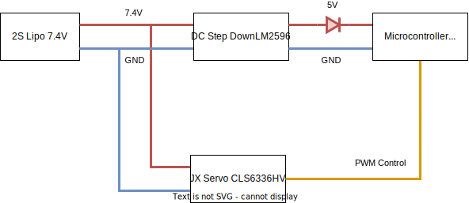

# Hardware Design
This repository contains the design files associated with the hardware mallet holder.
Further the firmware employed on the micro controller and a supporting calibration procedure script is contained.

## Hardware Model Design
[OpenSCAD](https://openscad.org/) was used for the design of the 3D printable models.
Generally the designs can be separated into one and two mallet design, where the one mallet designs were the basis for the two mallet approaches.

### Two Mallet Designs
The two mallet designs are split into two categories, the servo controlled element and the attachments.
The servo controlled element contains all electronics and two mounting points for an attachment making the design more modular.
The attachments were then mounting the mallets, either with or without compliance.
#### Servo Controlled Element
All servo controlled elements have a standard "claw" element which the attachment modules can be slotted in to.

The first version of the servo controlled element [double_mallet_servo](design/two_mallet/double_mallet_servo/double_mallet_servo.scad) mainly tested the servo based control for the second mallet and the attachment mount.
[double_mallet_servo_compliant_full](design/two_mallet/double_mallet_servo/double_mallet_servo_compliant_full.scad) was used to generated STL models for a first URDF file with the [double_flex_v2](design/two_mallet/modular_attachments/double_flex_v2.scad) included.
Later versions were created in a more modular fashion.

[double_mallet_servo_UR5](design/two_mallet/double_mallet_servo/double_mallet_servo_UR5.scad) is the second iteration of the element. The length of the part was increased to allow the custom gripper to grab the device from the top.
Further the control and power electronics could be added to the back.
The top plate was changed to have indexing ridges to the gripper end effector of the UR5.
The [double_mallet_servo_UR5_battery](design/two_mallet/double_mallet_servo/double_mallet_servo_UR5_battery.scad) added a battery holder for the 2s lipo to the bottom plate.

#### Attachments
Three attachment design files exist for the two mallet holder.
All designs feature a standardized attachment mechanism to be added to the servo controlled element.

First the [static_mallet_attachment](design/two_mallet/modular_attachments/static_mallet_attachment.scad) is a simple static holder without added compliance generally used for testing.

In the final version the [double_flex_v2](design/two_mallet/modular_attachments/double_flex_v2.scad) has been used. It is based on the [double_flex_v1](design/one_mallet/double_flex_v1/mallet_mount_double_flex_v1.scad) and as such allows for flexibility in both directions using rubber bands. Two additional pieces of sponge were added at the top and bottom to dampen the movements.

[double_flex_v2_collision](design/two_mallet/modular_attachments/double_flex_v2_collision.scad) was not used.

### One Mallet Designs
The [rigid_base_version](design/one_mallet/rigid_base_version/rigid.scad) is the design used for playing with only one mallet. It features a simple holder and grabbing points for the end effector.

To generate louder sounds a compliant approach was devised.

[v1](design/one_mallet/v1/mallet_mount_v1.scad) is the first compliant design, featuring a one directional, up compliance when hitting the instrument. The compliance is achieved with rubber bands. [v2](design/one_mallet/v2/mallet_mount_v2.scad) is a minor iteration on the design using bearings and felt stickers to reduce noise.

The [double_flex_v1](design/one_mallet/double_flex_v1/mallet_mount_double_flex_v1.scad) allowed compliance into the up and down direction which showed improvements in the loudness of the instrument.

## Firmware
The firmware is implemented using the [Arduino](https://www.arduino.cc/) framework.
A [Raspberry Pi Pico W](https://www.raspberrypi.com/documentation/microcontrollers/raspberry-pi-pico.html) is used as the controller of the device.

### Protocol
The protocol used for the communication between ROS and the microcontroller is based on simple string commands. For both the wifi and serial version the same protocol is used.
Commands for the serial version have to be \n terminated.
The wifi version accepts both with and without

At first the ROS side is expected to request the bounds and resolution using the "l" command.
This allows for multiple devices with different bound to be used interchangeably though it could also be realized with config parameters on the ROS side.

The "p" command is used in the read phase of the hardware_interface (See [marimbabot_hardware](https://github.com/UHHRobotics22-23/marimbabot/tree/main/marimbabot_hardware)).

Lastly the "s" command allows the ROS side to give a integer valued command position to the microcontroller.

| Command           | Response                               | Command Description                             | Response Description                                                                                     |
|-------------------|----------------------------------------|-------------------------------------------------|----------------------------------------------------------------------------------------------------------|
| s \<value>        | ok, err_input_num, err_input_range     | Commands the servo to move to the value <value> | Errors for invalid number formats or numbers out of range of the safety limits or ok for acknowledgement |
| p                 | p \<value>                             | Requests the current target value               | Returns the current target value <value>                                                                 |
| l                 | l <min_val> <max_val> <val_resolution> | Requests the limits of the device               | Return the max and min value bounds and the resolution of the value parameter (0-res)                    |
| <invalid_command> | err_cmd                                | Any command other than the listed ones          | Error code for and invalid / unknown command                                                             |

### Flavours
Two firmwares were written as a part of the development process.
First one using a usb serial connection and secondly one using a wifi network created by the microcontroller.

Both firmwares feature the min and max value at the top of the file.
These are the max and min angle the servo can safely be set to and depends on the real world alignment of the servo and the 3d print.
The values for each device are found in a manual testing project by sending manual "s" commands.
The resolution for both is set to 180 as the servo can cover 180°
Alternatively the resolution could be increased by using direct the [pwm millisecond control mode](https://www.arduino.cc/reference/en/libraries/servo/writemicroseconds/).

#### Wifi
The wifi firmware is found in the [mallet_play_servo_wifi](arduino_code/mallet_play_servo_wifi/mallet_play_servo_wifi.ino) project.

The SSID and the password of the generated network can be set at the top of the file and needs reflashing.
Further the port of the UDP server can be adjusted inside of the setup function.

Additional Note: In the libraries for the Raspberry Pi Pico W we found the Servo library to behave in unexpected ways which required a doubling of the input value to achieve the actually requested angle.

#### Serial
The serial firmware is found in the [mallet_play_servo](arduino_code/mallet_play_servo/mallet_play_servo.ino) project.

In the serial firmware the update frequency can be adjusted by changing the delay at the end of the loop.
The baud rate can be adjusted in the setup function. A high baud rate is needed to minimize the communication overhead.

## Electronics Design
The system was designed to be fully portable and battery powered to enable the usage in differing robotic arms.
Further the main used arms power budget was not able to power the device as the custom end effector gripper exhausted this.

List of parts:
- Servo: [JX Servo CLS6336HV](http://jx-servo.com/en/Product/CORELESS1/HVcs/480.html)
- Battery: [CHHL 2S 2200mAh 30C](https://chinahobbyline.com/collections/cnhl-voltage-7-4v-2s-lipo-batteries/products/cnhl-2200mah-7-4v-2s-30c-lipo-battery-with-t-plug)
- DC Step Down: [LM2596](https://www.az-delivery.de/en/products/lm2596s-dc-dc-step-down-modul-1)
- Microcontroller: [Raspberry Pi Pico W](https://www.raspberrypi.com/documentation/microcontrollers/raspberry-pi-pico.html)
- A safety diode preventing current running back from a USB 5V supply

The system uses a 2s LIPO as its power source.
The servo is directly powered by the battery.
For the Raspberry Pi Pico W can only accept input voltages up to 5.5V.
A step down converter was used to step the 6-8V of the battery to 5V to safely power the microcontroller.

The full wiring diagram is shown in the following figure

## Hardware Calibration
The hardware calibration scripts are found in the [hardware_calibration](hardware_calibration) folder. The calibration is done by using a Azure Kinect depth camera in combination of color separation to find the 3d position of the red tapes on the mallets. The 3d coordinates are used to find the distance between the elements.
A mathematical model of the two mallet assembly is then used to find the expected opening angle from the distance. This angle is then compared to the commanded angle.

### How to use
First install the python dependencies using the [requirements.txt](hardware_calibration/requirements.txt) found in the hardware_calibration folder.

#### Setup
Use the azure kinect depth camera and connect it to the computer. A top down orientation onto the two mallet assembly indicated the best results. Clean the space of other red elements or cover them (like the red cables on the assembly).
Connect the computer to the Wifi sent out by the mallet assembly (the scripts use the raw control commands).

#### Data Collection
Two scripts are used for the measurement process.

First start [hardware_calibration.py](hardware_calibration/hardware_calibration.py).
This script uses the depth camera to measure the distance of the red tapes on the mallet.
The results are logged into a timestamped csv file (f"calibration-{time.time()}.csv").

Secondly start the [calibration_process.py](hardware_calibration/calibration_process.py).
This will generate the control input to the mallet holder and log to timestamp of each command.
One full sweep is run.
The data it logged into a timestamped csv file (f"calibration_pos-{time()}.csv").

After the sweep stop both scripts.

#### Data Preparation
To prepare the results remove all distance measurements before the first command value.
The analysis expects a continuous numberization of the meassurements.
The measured distance file also warrants careful examinations as the depth camera seems to have a few areas with bad accuracy.

#### Data Analysis
The data is analyzed using the Jupyter notebook [analyse_results.ipynb](hardware_calibration/analyse_results.ipynb).
To add new measurements extend the range operator in the 5th cell and run the notebook.
Especially the last graph gives a result about the angular offset for each commanded angle.